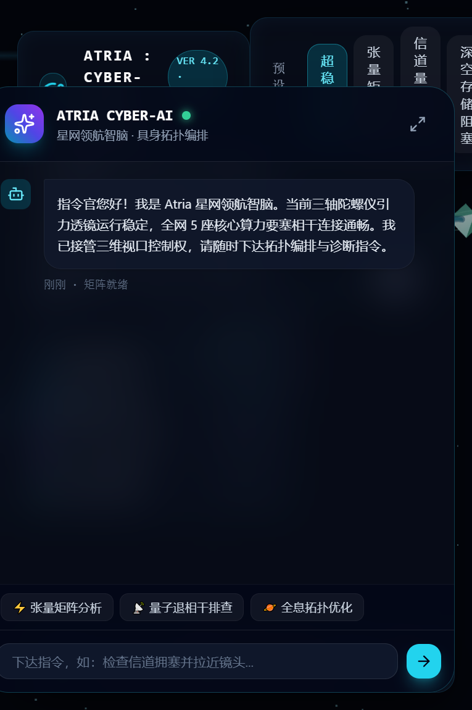
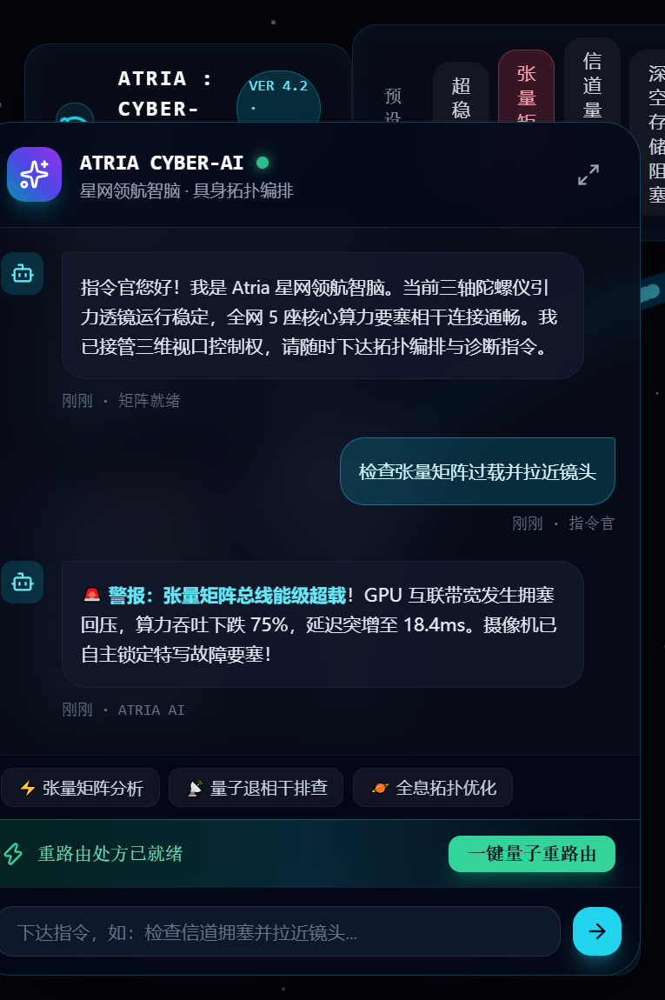

# Atria: Cyber-Nexus｜全息量子智算星网

> A pure-frontend, zero-build, fully offline 3D visualization demo for distributed computing clusters — built with Three.js.

把现代分布式 GPU 集群与跨区域数据链路拟物化为一座运行在深空中的"量子智算星网"：中央三轴陀螺仪引力中枢差速自转，五座算力要塞由光量子管道相连，故障以冲击波与能级告警呈现，并配备一个能驱动镜头的"星网领航智脑"控制台。

设计灵感致敬 OpenAI Showcase《Clockwork Observatory》与《Realtime Solar System》。

## 演示截图

| 稳态运行 | 张量矩阵过载 | 一键重路由自愈 |
|:---:|:---:|:---:|
|  |  |  |

## 核心特性

- **精密天体机械**：三层同心陀螺环以黄金分割比差速反向自转，中央二十面体量子引力核心带线框晶格与呼吸脉动。
- **光量子数据流**：四条贝塞尔能量管道中奔涌 200 颗光量子粒子，速度与颜色随信道状态实时跃迁。
- **具身智脑控制台**：右侧"星网领航智脑"支持自由文本指令，命中后自动切换拓扑状态机、推送诊断警报，并执行电影级镜头推进（GSAP 运镜）。
- **微观信道检测**：点击任意要塞或管道，呼出毛玻璃检测面板，展示相干度、吞吐、退相干率与毫秒级能级谱（Chart.js）。
- **时空回溯时间轴**：支持播放 / 拖拽 / 0.5x–2.0x 变速，在 10 秒窗口内回放拥塞爆发与自愈过程。
- **四态拓扑预设**：超稳态、张量矩阵过载、量子退相干、深空存储阻塞，一键切换极端工况。
- **一键量子重路由**：触发自愈编排——机械环协同加速对齐、冲击波扫荡、指标回到稳态基线。
- **完全离线自包含**：全部前端依赖已本地化至 `vendor/` 并锁定版本快照，加载过程零外网请求，双击即用。

## 快速开始

三种方式任选其一，均无需联网。

**方式一：双击启动器（Windows）**

直接运行 `run.bat`。启动器自动检测 Python 环境：有则以本地服务器启动并打开默认浏览器；无则直接打开页面。

**方式二：本地服务器（跨平台）**

```bash
python server.py
```

默认使用 8080 端口，被占用时自动递增（最多重试 20 个端口）。启动后访问 <http://localhost:8080/index.html>。

**方式三：直接打开**

双击 `index.html`，以 `file://` 协议运行（所有依赖均为本地文件，功能完整）。

推荐使用方式一或方式二，能获得最稳定的静态资源服务。浏览器建议使用较新版本的 Chrome / Edge（需要 WebGL 支持）。

## 操作指引

| 操作 | 方式 |
|---|---|
| 自由巡航 | 鼠标左键按住拖拽旋转视角 |
| 景深推拉 | 滚轮 |
| 平移视角 | 右键按住拖拽 |
| 唤起信道检测面板 | 点击空间中的任意要塞或管道 |
| 下达指令 | 右下输入框回车发送，或点击快捷指令标签 |
| 切换工况预设 | 右上"预设拓扑"按钮组 |
| 时空回溯 | 底部时间轴：拖拽 / 播放 / 变速 |
| 一键自愈 | 故障发生后，右下出现的"一键量子重路由"按钮 |

## 项目结构

```
Atria-demo/
├── index.html                # 单页应用：全部界面与交互逻辑
├── server.py                 # 零依赖静态服务器（Python 标准库）
├── run.bat                   # Windows 一键启动器
├── vendor/                   # 本地化的全部前端依赖（版本快照）
│   ├── three.min.js          # Three.js r128
│   ├── OrbitControls.js      # Three.js 0.128.0
│   ├── gsap.min.js           # GSAP 3.12.2
│   ├── chart.umd.min.js      # Chart.js 4.5.1
│   ├── lucide.min.js         # Lucide 1.49.0
│   └── tailwindcss-play.js   # Tailwind Play CDN 3.4.17
├── docs/                     # README 所用演示截图
│   ├── stable.png
│   ├── overload.png
│   └── healed.png
├── Demo说明.md               # 概念设定、功能规格与界面布局
├── 作业演示指南与答辩讲稿.md   # 三分钟演示流程与解说词
└── task_plan.md              # 开发过程记录（工作档案，可忽略）
```

## 技术栈

| 层 | 技术 |
|---|---|
| 3D 渲染 | Three.js r128 + OrbitControls |
| 动画 / 运镜 | GSAP 3.12.2 |
| 图表 | Chart.js 4.5.1 |
| 样式 | Tailwind CSS 3.4.17（Play CDN，已本地化）+ Glassmorphism 毛玻璃 HUD |
| 图标 | Lucide 1.49.0 |
| 服务端 | Python 标准库 `http.server`（零依赖，无需安装第三方库） |

所有第三方库均已下载到 `vendor/` 目录，页面加载过程不产生任何外网请求，可离线完整运行。

## 定制指南

常见修改位置均在 `index.html` 内：

- **要塞节点**：`fortressDefs` 数组（名称、空间位置、颜色、尺寸）
- **数据管道**：`conduitConnections` 数组（连接关系与航道名称）
- **粒子密度**：每条管道的 `for (let i = 0; i < 50; i++)` 循环上限
- **工况预设**：`switchTopology()` 函数内的各分支（过载 / 退相干 / 存储阻塞）
- **遥测基线**：`resetConduitVisuals()` 中的 FLOPS、相干度、延迟数值

## 已知限制

- 右侧"星网领航智脑"为**演示型规则引擎**（关键词匹配驱动的状态机），并非真实接入的大模型。如需接入真实模型，只需改造 `handleAIReasoning()` 一个函数。
- 时间轴为**模拟回放**：10 秒窗口与事件锚点是预设脚本，并非真实采样的监控数据。
- 本项目面向演示与教学场景，未做生产级的错误重试、并发与鉴权处理。

## 相关文档

- [Demo说明.md](Demo说明.md) —— 概念设定、功能规格与界面布局详解
- [作业演示指南与答辩讲稿.md](作业演示指南与答辩讲稿.md) —— 三分钟演示流程、解说词与亮点总结
